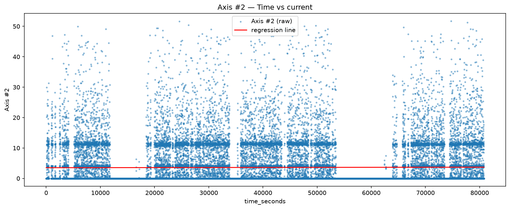
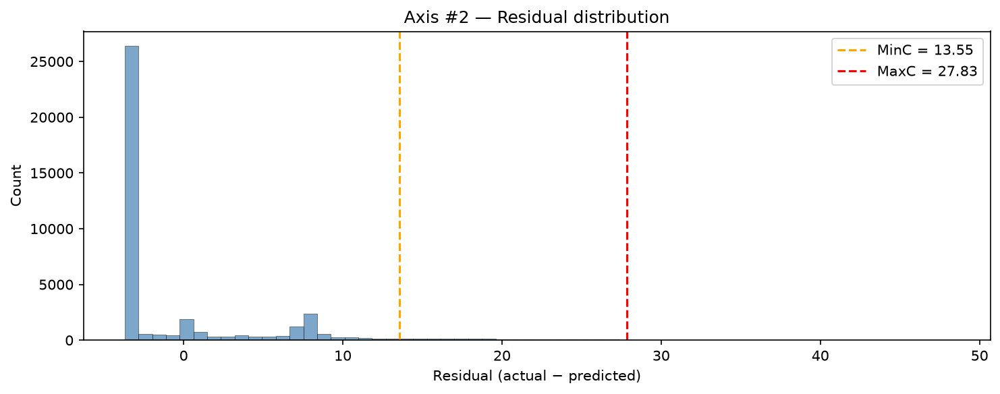
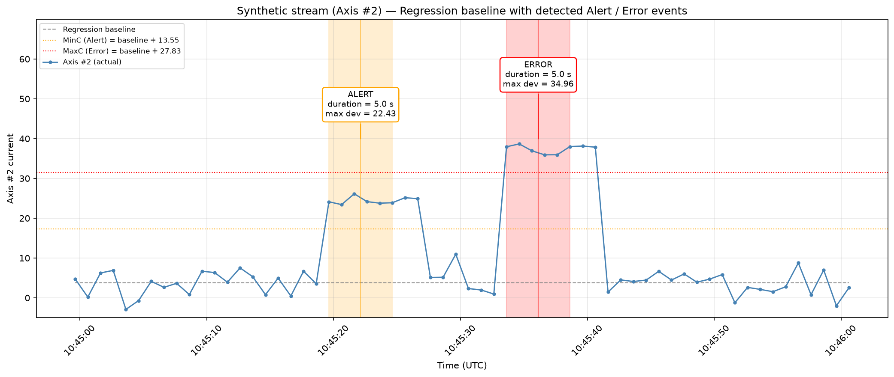

# Predictive Maintenance with Streaming Data and Linear Regression Alerts
---

## Project Summary

This project simulates real-world predictive maintenance: 
**catching early signs of equipment failure before critical breakdown occurs**.

### Key Workflow
1. **Data Ingestion:** Uploads sensor readings (8 axes of industrial current) to a cloud database ([Neon.tech](https://neon.tech)).
2. **Regression Baseline:** Fits `Time → Axis` univariate linear regressions to serve as stationary baselines.
3. **Threshold Discovery:** Analyzes residual distributions to establish percentile-based `MinC` (Alert) and `MaxC` (Error) thresholds without relying on arbitrary hardcoded limits.
4. **Real-Time Anomaly Detection:** Streams a synthetic test sequence into the database, evaluating continuous deviation durations ($T \ge 5\text{s}$) to flag stateful Alert and Error incidents.
5. **Reproducible Logging:** Logs all flagged events back to PostgreSQL and exports structured CSVs and diagnostic visualizations.

## Setup Instructions

### 1. Clone and enter the repo

```bash
git clone https://github.com/<your-username>/DataStreamVisualization_Workshop.git
cd DataStreamVisualization_Workshop

### 2. Create a virtual environment
python -m venv .venv

# Windows
.venv\Scripts\activate

# macOS / Linux
source .venv/bin/activate

### 3. Install dependencies
pip install -r requirements.txt

### 4. Configure Neon.tech connection
Create a .env file at the project root (this file must never be committed): DATABASE_URL=postgresql://<user>:<password>@<host>/<dbname>?sslmode=require

How to get the URL:

Sign up at https://neon.tech (free tier).

Create a new project.

Copy the Connection string from the dashboard.

Paste it into .env.

### 5. Run the notebook
Open predictive_maintenance_regression_linear_lab.ipynb in VS Code or Jupyter, select the .venv kernel, and Run cell by cell.

The notebook will:

Connect to Neon.

Upload training data (RMBR4-2_export_test.csv).

Train regression models per axis.

Discover Alert/Error thresholds from residuals.

Generate synthetic test data.

Stream it through the database.

Detect Alert/Error events.

Log events back to Neon and export CSVs.

## Regression & Alert Rules

**Regression.** For each axis, fit `Axis = slope × time_seconds + intercept` using scikit-learn's `LinearRegression`. 
The line is our **baseline** — the expected value at any moment. 
Slopes are near zero, so the baseline ≈ mean current.

**Residuals.** `residual = actual − predicted`. Positive residuals = axis drawing more current than expected. 
We only care about positive residuals (over-consumption).

**Thresholds (discovered from training residuals, not fixed):**

| Symbol | Definition | Purpose |
|---|---|---|
| MinC | Q95 of residuals | Alert threshold |
| MaxC | Q99 of residuals | Error threshold |
| T | 5 seconds | Minimum continuous duration |

**Why percentiles:** they adapt per-axis and don't assume normal residuals. 
Z-scores fail on Axis #8 (`Q95 < Std`) and Axis #7 (`Q95 ≈ Q99`).

**Rules (evaluated one observation at a time):**
Alert : residual ≥ MinC for ≥ T seconds continuously
Error : residual ≥ MaxC for ≥ T seconds continuously

---

## Plots

**1. Regression fit — Axis #2**



*Raw currents vs time, with the fitted regression line. Near-horizontal line confirms the axis is stationary.*

**2. Residual distribution — Axis #2**



*Histogram of training residuals with MinC (orange) and MaxC (red). Q95 = 13.55, Q99 = 27.83.*

**3. Annotated stream — Alert / Error events**



*Synthetic stream with detected events. Each shaded band is a sustained deviation; each callout shows event type, duration, and max deviation.*

| Axis | Event | Start (UTC) | Duration | Max dev |
|---|---|---|---|---|
| Axis #2 | ALERT | 10:45:19 | 5.0 s | 22.43 |
| Axis #2 | ERROR | 10:45:33 | 5.0 s | 34.96 |

**No false positives** in normal, gap, or recovery phases.

**4. Residual view — same events**


*Same stream plotted as residuals, showing the detector's decision boundary directly.*

---

## Results

### Discovered Thresholds (Axis #2)

| Threshold | Value |
| :--- | :--- |
| **MinC (Alert)** | 13.55 |
| **MaxC (Error)** | 27.83 |
| **T (Duration)** | 5 s |

### Detected Events

| Axis | Type | Duration | Max Deviation | Status |
| :--- | :--- | :--- | :--- | :--- |
| **Axis #2** | ALERT | 5.0 s | 22.43 | Triggered |
| **Axis #2** | ERROR | 5.0 s | 34.96 | Triggered |

---

## Technologies Used

* **Data Processing:** `pandas`, `numpy`
* **Machine Learning:** `scikit-learn`
* **Database:** `PostgreSQL` (Neon.tech), `psycopg2`
* **Visualization:** `matplotlib`
* **Environment:** `python-dotenv`, `Jupyter`

---

## Author & Course

* **Course:** Foundation ML — Data Stream Visualization Workshop
* **Author:** Alamir Ibrahim.